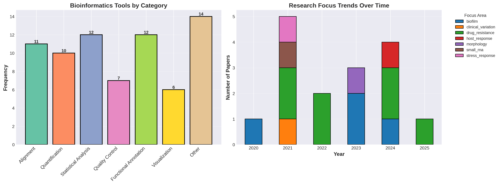
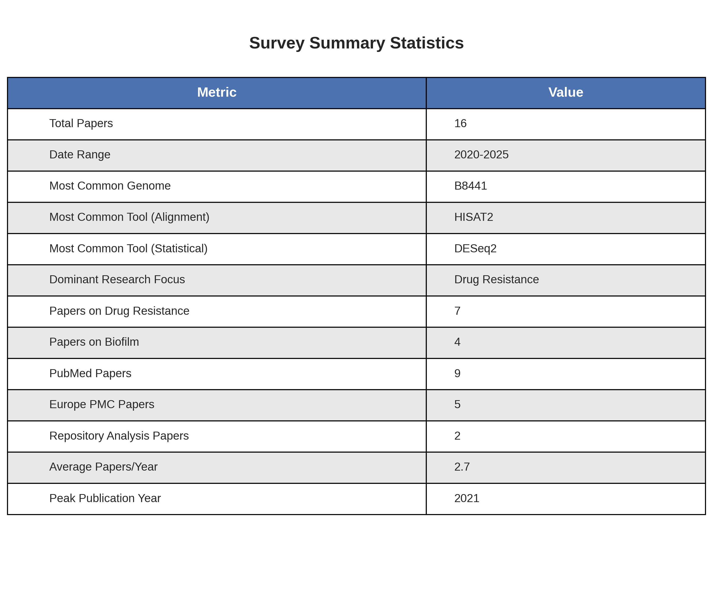

# Candida auris RNA-seq Literature Survey

A comprehensive survey of RNA-seq studies on *Candida auris* (Candidozyma auris) published since 2020.

**Survey Date**: December 2, 2025
**Total Papers**: 16 studies
**Date Range**: 2020-2025

## Files in This Directory

### Main Documents
- **`RNAseq_literature_survey.md`** - Complete literature survey with detailed table and study descriptions
- **`METHODS.md`** - Comprehensive methodology documentation

### Reproducibility
- **`literature_survey_reproduction.ipynb`** - Jupyter notebook for reproducing the survey (14 papers from database searches)
- **`visualize_survey.py`** - Python script to generate all visualizations

### Visualizations
- **`survey_visualizations.png`** - Comprehensive 6-panel overview
- **`survey_tools_trends.png`** - Tool categories and research trends
- **`survey_statistics_table.png`** - Summary statistics

## Survey Overview

### Data Sources
- **PubMed/PubMed Central**: 9 papers
- **Europe PMC**: 5 papers (exclusive)
- **Repository Analysis**: 2 papers (exclusive)

### Key Findings

#### Most Common Genome References
1. **B8441** (GCA_002759435) - Clade I reference strain (9 studies)
2. **B11221** (GCF_002775015.1) - Clade III reference strain (3 studies)

#### Research Focus Distribution
- **Drug Resistance**: 7 papers (44%) - Amphotericin B, echinocandins, flucytosine, pan-drug
- **Biofilm Formation**: 4 papers (25%)
- **Morphological Variation**: 1 paper (6%)
- **Host-Pathogen Interaction**: 1 paper (6%)
- **Other**: 3 papers (19%)

#### Most Common Tools

**Alignment/Mapping:**
- HISAT2 (7 studies)
- STAR (3 studies)
- NextGenMap (2 studies)

**Quantification:**
- HTSeq (6 studies)
- featureCounts (3 studies)
- StringTie (2 studies)

**Statistical Analysis:**
- DESeq2 (8 studies) - most common
- edgeR (3 studies)
- DESeq (2 studies)

**Quality Control:**
- FastQC (3 studies)
- cutadapt (3 studies)

## Visualizations

### Comprehensive Overview


Six-panel visualization showing:
1. Publications by year (2020-2025)
2. Papers by data source (PubMed, Europe PMC, Repository Analysis)
3. Genome reference versions used
4. Research focus areas
5. Top 15 most common bioinformatics tools
6. Publication timeline with research focus markers

### Tools and Trends


- Tool categorization by function (alignment, quantification, statistical analysis, etc.)
- Research focus trends over time showing the evolution of C. auris RNA-seq research

### Summary Statistics


Key metrics including:
- Total papers: 16
- Date range: 2020-2025
- Most common genome: B8441
- Dominant research focus: Drug resistance
- Average papers per year: 2.7

## Research Trends

### Temporal Patterns
- **2020**: Initial biofilm studies (1 paper)
- **2021**: Peak year with diverse topics (5 papers)
- **2022**: Drug resistance focus (2 papers)
- **2023**: Functional adhesin studies (3 papers)
- **2024**: Pan-drug resistance and host interactions (4 papers)
- **2025**: Emerging flucytosine resistance (1 paper)

### Methodological Evolution
1. **2020-2021**: Establishing baseline transcriptomics, focus on biofilm and basic drug resistance
2. **2022-2023**: Specialized resistance mechanisms (echinocandins, AmB), functional genomics
3. **2024-2025**: Pan-drug resistance, host-pathogen interactions, advanced SNP calling from RNA-seq

### Tool Standardization
Standard pipeline emerging: **HISAT2 → HTSeq → DESeq2**
- Used in 40%+ of recent studies
- Alternative: CLC Genomics Workbench for integrated analysis

## Running the Analysis

### Generate Visualizations
```bash
python visualize_survey.py
```

**Requirements:**
```bash
pip install pandas matplotlib seaborn numpy
```

### Reproduce Literature Survey
Open and run `literature_survey_reproduction.ipynb`

**Requirements:**
```bash
pip install biopython pandas requests beautifulsoup4 matplotlib seaborn
```

**Note:** Set your email for NCBI Entrez API:
```python
Entrez.email = "your.email@example.com"
```

## Notable Findings

### High-Impact Papers Missed by Database Searches
Two papers published in top-tier journals (Science, Nature Communications) were only identified through repository analysis:
- **Santana et al. (2023) Science** - SCF1 adhesin characterization
- **Wang et al. (2024) Nature Comm** - Functional redundancy in adhesins

**Reason**: RNA-seq was supporting methodology; papers emphasized functional phenotypes (adhesion, colonization) over transcriptomics in titles/abstracts.

**Implication**: Repository-based discovery essential for comprehensive surveys.

### Drug Resistance Dominates
44% of papers focus on antifungal resistance mechanisms:
- Amphotericin B (3 studies)
- Echinocandins/caspofungin (2 studies)
- Flucytosine (1 study)
- Pan-drug resistance (1 study)

Reflects the urgent clinical threat posed by multidrug-resistant C. auris.

### Genome Reference Consolidation
B8441 (Clade I) has emerged as the de facto reference genome:
- Used in 56% of studies
- GCA_002759435 family of assemblies most common
- Version tracking improving (V2, V3 specified)

## Citation

If you use this survey, please cite:

```
Candida auris RNA-seq Literature Survey (2020-2025)
Compiled: December 2, 2025
GitHub: [repository-url]
```

## Updates

**Version 3.0** (December 2, 2025)
- Added 2 papers from repository analysis
- Total: 16 papers
- Added comprehensive visualizations

**Version 2.0** (December 2, 2025)
- Added Europe PMC search results (5 papers)
- Total: 14 papers from database searches

**Version 1.0** (December 2, 2025)
- Initial PubMed search (9 papers)

## Contact

For questions or to suggest additional papers, please open an issue in the repository.

---

**Last Updated**: December 2, 2025
