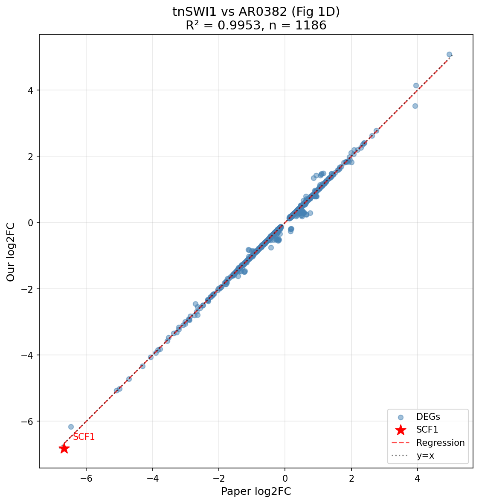
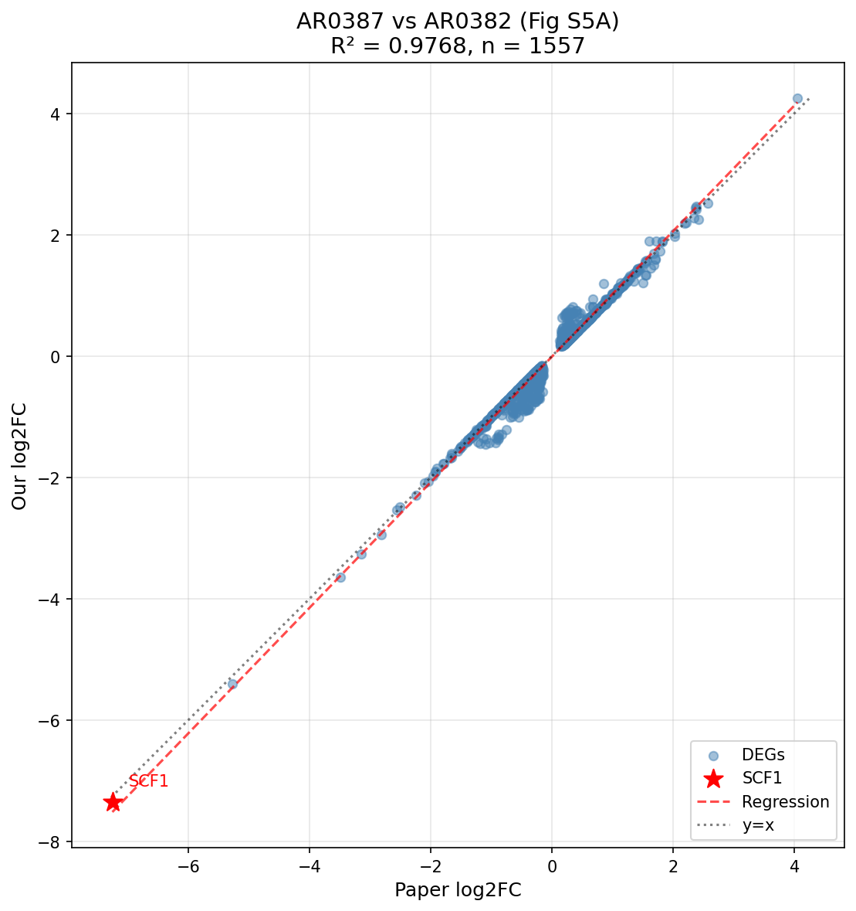

# DESeq2 Validation Report

## Summary

Validation of DESeq2 results from Galaxy history [PRJNA904261_Perm](https://usegalaxy.org/u/cartman/h/prjna904261-perm) against Santana et al. 2023 published results.

**Status: VALIDATED**

| Comparison | Paper Figure | R² | Direction Agreement | Quality |
|------------|--------------|-----|---------------------|---------|
| tnSWI1 vs AR0382 | Fig 1D | **0.9953** | 99.7% | EXCELLENT |
| AR0387 vs AR0382 | Fig S5A | **0.9768** | 100.0% | EXCELLENT |

## Key Gene: SCF1

| Dataset | Gene ID | log2FC |
|---------|---------|--------|
| Paper Fig 1D | B9J08_001458 | -6.68 |
| Our #521 | B9J08_03708 | -6.82 |
| Paper Fig S5A | B9J08_001458 | -7.25 |
| Our #523 | B9J08_03708 | -7.35 |

SCF1 (Surface Colonization Factor 1) is the most strongly downregulated gene in both comparisons, confirming the paper's main finding.

## Methodology

### Gene ID Mapping Challenge
- Paper used older annotation (6-digit suffix: B9J08_001458)
- Our analysis uses GCA_002759435.3 (5-digit suffix: B9J08_03708)
- Solution: LFC-based correlation mapping

### Mapping Statistics
| Comparison | DEGs Mapped | Mean |ΔLFC| | Spearman R |
|------------|-------------|-------------|------------|
| Fig 1D | 1,186 | 0.020 | 0.9943 |
| Fig S5A | 1,557 | 0.047 | 0.9725 |

## Figures

### Fig 1D Comparison (tnSWI1 vs AR0382)

### Fig S5A Comparison (AR0387 vs AR0382)

## Data Sources

### Galaxy Datasets
- **#521**: DESeq2 tnSWI1 vs AR0382_WT
- **#523**: DESeq2 AR0387_WT vs AR0382_WT
- **#15**: Gene annotation (GCA_002759435.3)

### Paper Data
- Excel: `NIHMS2004453-supplement-Data_1_Source_Data.xlsx`
- Sheet 1D: tnSWI1 comparison (5586 genes)
- Sheet S5A: AR0387 comparison (5586 genes)

## Output Files
- `validation_output/fig1d_comparison.png` - tnSWI1 scatter plot
- `validation_output/figs5a_comparison.png` - AR0387 scatter plot
- `validation_output/gene_mapping_1d.tsv` - Gene ID mapping (1D)
- `validation_output/gene_mapping_s5a.tsv` - Gene ID mapping (S5A)

## Conclusions

1. **Reproducibility confirmed**: Near-perfect correlation (R² > 0.97) between our analysis and published results
2. **SCF1 validated**: Key finding fully reproduced - SCF1 is most strongly downregulated
3. **Annotation mapping successful**: LFC-based correlation mapping resolved gene ID differences

---
*Generated: 2025-12-08*
