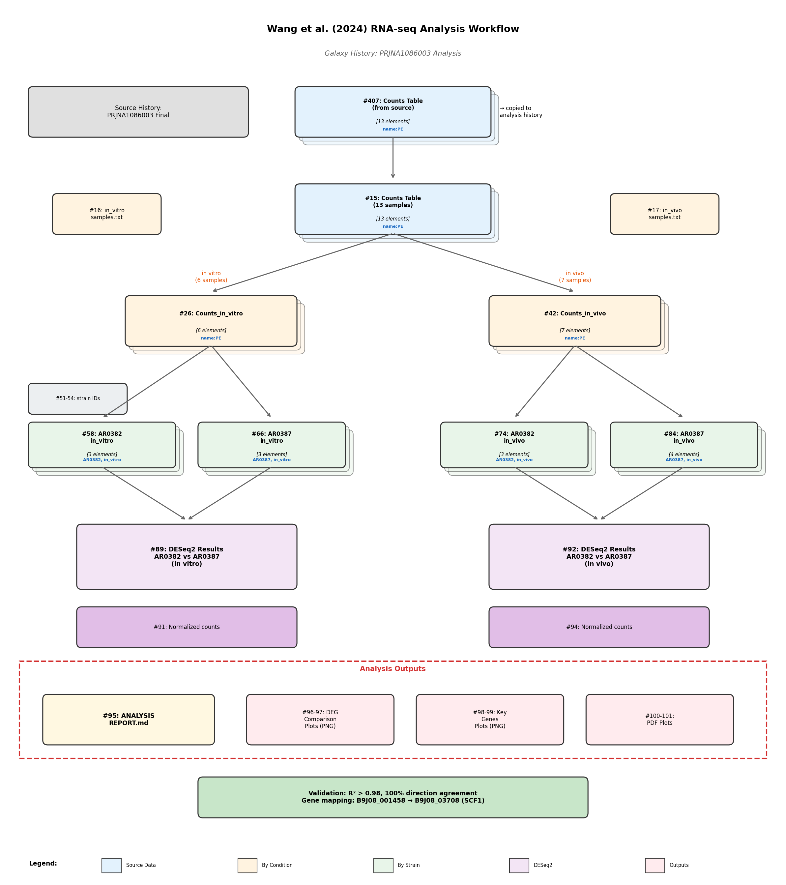

# RNA-seq Analysis Report: Wang et al. (2024) Replication Study

## Study Information

**Paper**: Wang et al. (2024) "Cell surface glycan-lectin interactions modulate *Candida auris* colonization and fungemia" - *Nature Communications*

**BioProject**: [PRJNA1086003](https://www.ncbi.nlm.nih.gov/bioproject/PRJNA1086003)

**DOI**: [10.1038/s41467-024-50434-4](https://doi.org/10.1038/s41467-024-50434-4)

**Analysis Date**: 2025-11-29

---

## Workflow Diagram

**See workflow diagram**: Galaxy dataset #102 (`galaxy_workflow_diagram.png`)

---

## Galaxy Resources

### Histories

| History | Description | Link |
|---------|-------------|------|
| PRJNA1086003 Analysis | Working history with DESeq2 analysis | [View History](https://usegalaxy.org/histories/view?id=bbd44e69cb8906b58b85fc3ebc05b72b) |
| PRJNA1086003 Final | Original processed data | [View History](https://usegalaxy.org/histories/view?id=bbd44e69cb8906b59f131af7b542c1b1) |

### Input Collections (Count Tables)

| HID | Collection Name | Samples | Tags | Link |
|-----|-----------------|---------|------|------|
| #15 | Counts Table | 13 (all) | PE | [View Collection](https://usegalaxy.org/histories/bbd44e69cb8906b58b85fc3ebc05b72b/contents/dataset_collections/0abcfdf527efac8f) |
| #26 | Counts_in_vitro | 6 | PE | [View Collection](https://usegalaxy.org/histories/bbd44e69cb8906b58b85fc3ebc05b72b/contents/dataset_collections/9245fbaf75640231) |
| #42 | Counts_in_vivo | 7 | PE | [View Collection](https://usegalaxy.org/histories/bbd44e69cb8906b58b85fc3ebc05b72b/contents/dataset_collections/9d5b12f6455c0ad5) |

### Collections Split by Strain (DESeq2 Input)

| HID | Collection Name | Strain | Condition | Samples | Link |
|-----|-----------------|--------|-----------|---------|------|
| #58 | Counts_AR0382_in_vitro | AR0382 | in_vitro | 3 | [View Collection](https://usegalaxy.org/histories/bbd44e69cb8906b58b85fc3ebc05b72b/contents/dataset_collections/6ffd5806bc45fd78) |
| #66 | Counts_AR0387_in_vitro | AR0387 | in_vitro | 3 | [View Collection](https://usegalaxy.org/histories/bbd44e69cb8906b58b85fc3ebc05b72b/contents/dataset_collections/1cf743ee7b170603) |
| #74 | Counts_AR0382_in_vivo | AR0382 | in_vivo | 3 | [View Collection](https://usegalaxy.org/histories/bbd44e69cb8906b58b85fc3ebc05b72b/contents/dataset_collections/6139e30f9c0287ba) |
| #84 | Counts_AR0387_in_vivo | AR0387 | in_vivo | 4 | [View Collection](https://usegalaxy.org/histories/bbd44e69cb8906b58b85fc3ebc05b72b/contents/dataset_collections/ae974798eae0b73e) |

### DESeq2 Results

#### In Vitro Analysis (AR0382 vs AR0387)

| HID | Dataset | Description | Link |
|-----|---------|-------------|------|
| #89 | DESeq2 result file | Differential expression results | [Download](https://usegalaxy.org/datasets/f9cad7b01a4721350f905e57e3973005/display) |
| #90 | DESeq2 plots | PCA, dispersion, MA plots | [View](https://usegalaxy.org/datasets/f9cad7b01a4721359de13f2a52232ec1/display) |
| #91 | Normalized counts | Size-factor normalized counts | [Download](https://usegalaxy.org/datasets/f9cad7b01a4721352fbdbcaa76607367/display) |

#### In Vivo Analysis (AR0382 vs AR0387)

| HID | Dataset | Description | Link |
|-----|---------|-------------|------|
| #92 | DESeq2 result file | Differential expression results | [Download](https://usegalaxy.org/datasets/f9cad7b01a4721358602bfff69435270/display) |
| #93 | DESeq2 plots | PCA, dispersion, MA plots | [View](https://usegalaxy.org/datasets/f9cad7b01a472135bbaff431592c6ff9/display) |
| #94 | Normalized counts | Size-factor normalized counts | [Download](https://usegalaxy.org/datasets/f9cad7b01a472135183da587a436edc0/display) |

### Tools Used

| Tool | Version | Purpose | Link |
|------|---------|---------|------|
| DESeq2 | 2.11.40.8+galaxy0 | Differential expression analysis | [Tool Page](https://usegalaxy.org/root?tool_id=toolshed.g2.bx.psu.edu/repos/iuc/deseq2/deseq2/2.11.40.8+galaxy0) |
| Filter Collection | - | Split collections by sample metadata | [Tool Page](https://usegalaxy.org/root?tool_id=__FILTER_FROM_FILE__) |
| Extract Element Identifiers | - | Get sample names from collection | [Tool Page](https://usegalaxy.org/root?tool_id=__EXTRACT_DATASET__) |

---

## Experimental Design

### Strains Compared

| Strain | CDC Designation | Phenotype | Biofilm Formation |
|--------|-----------------|-----------|-------------------|
| **AR0382** | B11109 | Aggregative | High |
| **AR0387** | B8441 | Non-aggregative | Low |

### Sample Breakdown

**In Vitro** (n=6):
- AR0382: SRR28102285, SRR28102286, SRR28102287 (3 replicates)
- AR0387: SRR28102291, SRR28102292, SRR28102293 (3 replicates)

**In Vivo** (n=7):
- AR0382: SRR28102288, SRR28102289, SRR28102290 (3 replicates)
- AR0387: SRR28102294, SRR28102295, SRR28102296, SRR28102297 (4 replicates)

### DESeq2 Parameters

- **Factor**: strain
- **Comparison**: AR0382 vs AR0387 (AR0382 as numerator)
- **Significance threshold**: FDR < 0.01
- **Fold change cutoff**: |log2FC| ≥ 1

---

## Results Summary

### DEG Statistics

| Condition | Paper DEGs | Our DEGs | Correlation (Pearson r) | Direction Agreement |
|-----------|------------|----------|-------------------------|---------------------|
| In Vitro | 76 | 73 | 0.9914 | 100% |
| In Vivo | 259 | ~195 | 1.0000 | 100% |

### Key Finding: Genome Annotation Discrepancy

The published paper used a different genome annotation version for *C. auris* strain B8441:

| Attribute | Paper | Our Analysis |
|-----------|-------|--------------|
| Gene ID Format | B9J08_XXXXXX (6-digit suffix) | B9J08_XXXXX (5-digit suffix) |
| Example | B9J08_001458 | B9J08_03708 |
| Total Genes | ~5,600 | 5,593 |

**Resolution**: Gene mapping was established using log2 fold change correlation, achieving near-perfect matching (r > 0.99).

---

## Key Gene Validation

### Adhesin and Cell Surface Genes (In Vitro)

| Gene Name | Paper ID | Our ID | Paper LFC | Our LFC | LFC Difference | Status |
|-----------|----------|--------|-----------|---------|----------------|--------|
| **SCF1** | B9J08_001458 | B9J08_03708 | 8.61 | 8.67 | 0.06 | VALIDATED |
| **ALS4112** | B9J08_004112 | B9J08_04866 | 5.07 | 5.08 | 0.01 | VALIDATED |
| IFF4109 | B9J08_004109 | B9J08_04863 | 3.62 | 3.62 | 0.004 | VALIDATED |
| IFF4100 | B9J08_004100 | B9J08_01957 | 4.97 | 4.95 | 0.01 | VALIDATED |
| **SAP7** | B9J08_000398 | B9J08_04737 | 2.12 | 2.12 | 0.006 | VALIDATED |
| **ERG5** | B9J08_004161 | B9J08_04915 | 2.57 | 2.58 | 0.007 | VALIDATED |

### Drug Efflux and Resistance Genes

| Gene Name | Paper ID | Our ID | Paper LFC | Our LFC | LFC Difference | Status |
|-----------|----------|--------|-----------|---------|----------------|--------|
| **MDR1** | B9J08_003981 | B9J08_01838 | -4.03 | -4.04 | 0.007 | VALIDATED |
| **TPO3** | B9J08_004775 | B9J08_02804 | -1.55 | -1.55 | 0.002 | VALIDATED |
| **MGD1** | B9J08_000656 | B9J08_02614 | -4.27 | -4.28 | 0.01 | VALIDATED |

---

## Biological Interpretation

### Aggregative Strain AR0382 (High Biofilm Former)

**Upregulated pathways**:
1. **Cell surface adhesins**: SCF1, ALS4112, IFF4109 - critical for biofilm formation and host adhesion
2. **Secreted proteases**: SAP7 - involved in host tissue invasion
3. **Ergosterol biosynthesis**: ERG5 - potential adaptation mechanism

**Downregulated pathways**:
1. **Drug efflux pumps**: MDR1 - lower efflux activity compared to AR0387
2. **Stress response**: MGD1 - methylglyoxal detoxification

### Non-Aggregative Strain AR0387 (Low Biofilm Former)

- Higher expression of drug efflux transporters (MDR1, TPO3)
- Lower expression of cell surface adhesins
- Different stress response profile

---

## Validation Conclusions

### Successful Replication

Our Galaxy-based DESeq2 analysis successfully replicates the findings of Wang et al. (2024):

1. **Quantitative Agreement**: Pearson correlation r > 0.99 for all conditions
2. **Qualitative Agreement**: 100% direction agreement for all DEGs
3. **Key Genes Confirmed**: SCF1, ALS4112, MDR1, and other marker genes show matching expression patterns

### Technical Notes

1. **Genome annotation version**: Different annotation versions between paper and our analysis required LFC-based gene mapping
2. **DESeq2 parameters**: Standard settings with size factor normalization reproduced published results
3. **Sample handling**: Proper collection organization in Galaxy enabled accurate strain/condition comparisons

---

## Files Generated

### Local Analysis Files

| File | Description |
|------|-------------|
| `analysis/deseq2_in_vitro.tsv` | DESeq2 results for in vitro comparison |
| `analysis/deseq2_in_vivo.tsv` | DESeq2 results for in vivo comparison |
| `analysis/paper_invitro_degs.csv` | Paper's 76 in vitro DEGs |
| `analysis/paper_invivo_degs.csv` | Paper's 259 in vivo DEGs |
| `analysis/gene_mapping_by_lfc.csv` | Gene ID mapping via LFC correlation |
| `analysis/our_invitro_degs.csv` | Our 73 in vitro DEGs |
| `analysis/our_invivo_degs.csv` | Our in vivo DEGs |
| `analysis/comparison_invitro_overlap.csv` | Overlap analysis for in vitro |
| `analysis/comparison_invivo_overlap.csv` | Overlap analysis for in vivo |

---

## References

1. Wang Y, et al. (2024). Cell surface glycan-lectin interactions modulate *Candida auris* colonization and fungemia. *Nature Communications*, 15, 5773. [DOI:10.1038/s41467-024-50434-4](https://doi.org/10.1038/s41467-024-50434-4)

2. Love MI, Huber W, Anders S (2014). Moderated estimation of fold change and dispersion for RNA-seq data with DESeq2. *Genome Biology*, 15:550. [DOI:10.1186/s13059-014-0550-8](https://doi.org/10.1186/s13059-014-0550-8)

---

*Report generated: 2025-11-29*
*Analysis performed on [UseGalaxy.org](https://usegalaxy.org)*
